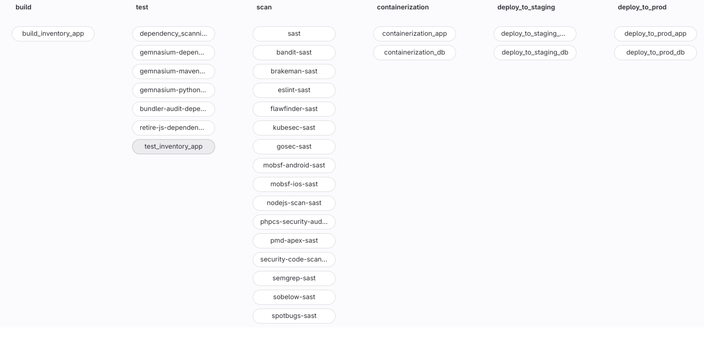

<!-- ctrl + shift + v to preview -->
# gitlab-pipelines

## Table of Contents
- [gitlab-pipelines](#gitlab-pipelines)
  - [Table of Contents](#table-of-contents)
  - [General Information](#general-information)
  - [Features](#features)
  - [Technologies Used](#technologies-used)
  - [Team \& My Work](#team--my-work)
  - [Main Learnings](#main-learnings)
  - [Setup](#setup)
  - [Images](#images)

## General Information
This project was made as a school project in [kood/Jõhvi](https://kood.tech/) (5.8.2023)

The project required me to deploy a [previously](https://github.com/JesusKris/vagrant-microservice-architecture) created microservice architecture which included a gateway, a message queue system RabbitMQ & 2 other services with their own PostgreSQL instances, using K3s to the AWS Cloud.

I also had to provision my own Gitlab instance & runners using Ansible and create CI/CD pipelines for each microservice.

K3S is a lightweight version of K8s which has been stripped of many non primary features. It makes it a perfect tool to test things locally or the application does not require a powerhouse such as K8s. 

The cloud infrastructure is provisioned using IaC tool called Terraform.


  **NB! Different source control platform was used hence no commit history.**

## Features
- Microservice architecture
- K3s powered cluster
- Automatic infrastrcture provisioning using Terraform
- Message queue system

## Technologies Used

[K3S](https://k3s.io/)

[Terraform](https://www.terraform.io/)

[Dockerhub](https://hub.docker.com/)

[Docker](https://www.docker.com/)

[kubectl](https://kubernetes.io/docs/tasks/tools/)

[AWS](https://aws.amazon.com/)

[Gitlab](https://about.gitlab.com/)

[Ansible](https://www.ansible.com/)

## Team & My Work
This was a solo project.

I did everything myself.

## Main Learnings
- Basics of Ansible
- Basics of Gitlab CI/CD
- Gitlab Terraform states

## Setup
Clone the repository
```
git clone https://github.com/JesusKris/gitlab-pipelines.git
```
- Create an AWS Account
- Create a security key in AWS EC2 and call it k3s-cluster.pem. Make sure to import it in the root of this project.
- Create an access key in security credentials under EC2 section.
- Install Docker
- Make sure to have Dockerhub account and create an access token there
- Rename env.json.example under ./playbooks to env.json and fill out everything besides GITLAB_ACCESS_KEY
- Install Ansble

Provision Gitlab and its runners:
```
sudo ansible-playbook configure_gitlab.yaml
```

- Open Gitlab instance on your defined host, log in as root and create an access token. Add the access token to env.json

Provision Gitlab setttings and repositories:
```
sudo ansible-playbook configure_repos.yaml
```

- Manually clone all of the repos and copy the sources to each corresponding repository

## Images


- #### Repository:

     

- #### Group Global variables

    


- #### Pipelines:

    - #### [api-gateway](/src/api-gateway/.gitlab-ci.yml) 
    
    

    - #### [billing-app](/src/billing-app/.gitlab-ci.yml) 
    
    

    - #### [infrastructure](/src/infrastructure/.gitlab-ci.yml) 
    
    

    - #### [inventory-app](/src/inventory-app/.gitlab-ci.yml) 
    
    
